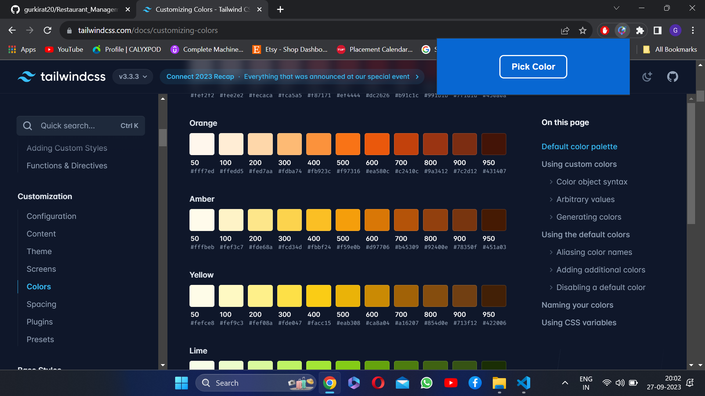
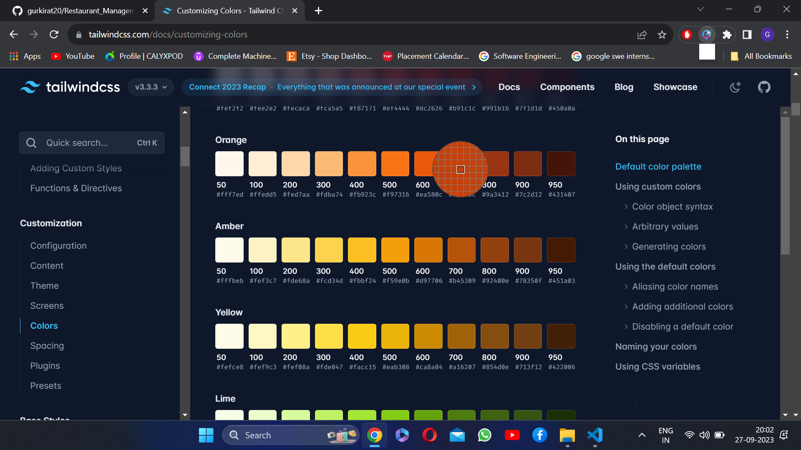
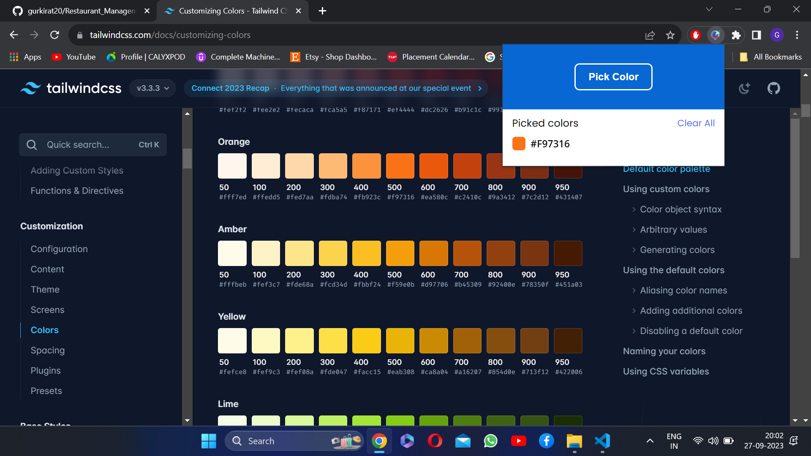
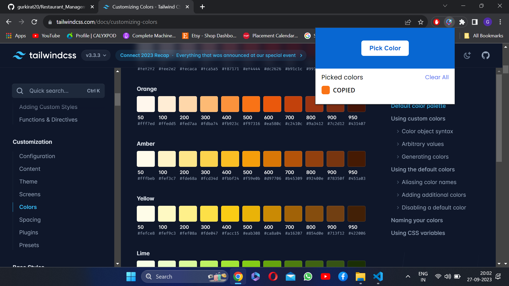

# Color Picker Chrome Extension

This is a simple Color Picker Chrome Extension made using EyeDropper API and other Chrome APIs

 

https://github.com/gurkirat20/Color_Picker_Chrome_Extension/assets/91982831/b14ac2a4-5b22-4537-8505-6109996a1af3

# Screenshots

</img>  
</img>  
</img>  
</img>  
</img>  
</img>  
</img>
